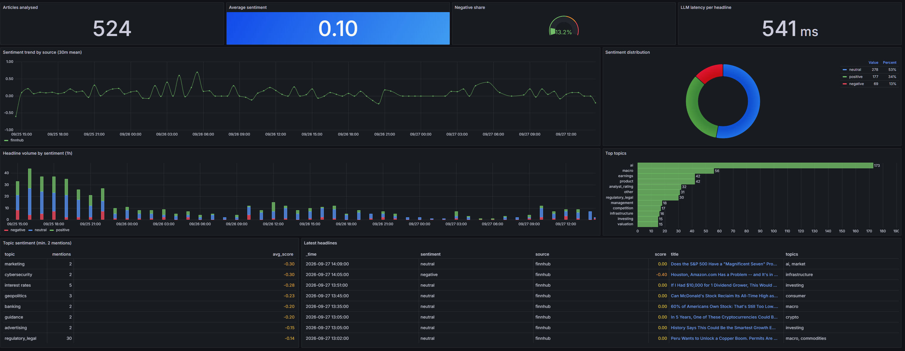
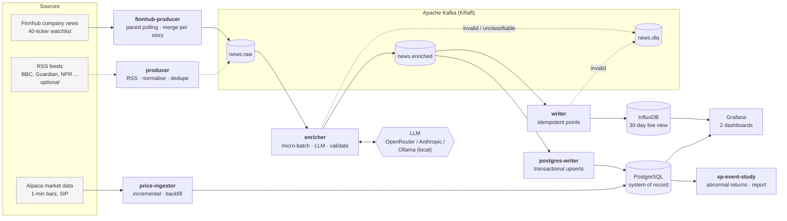
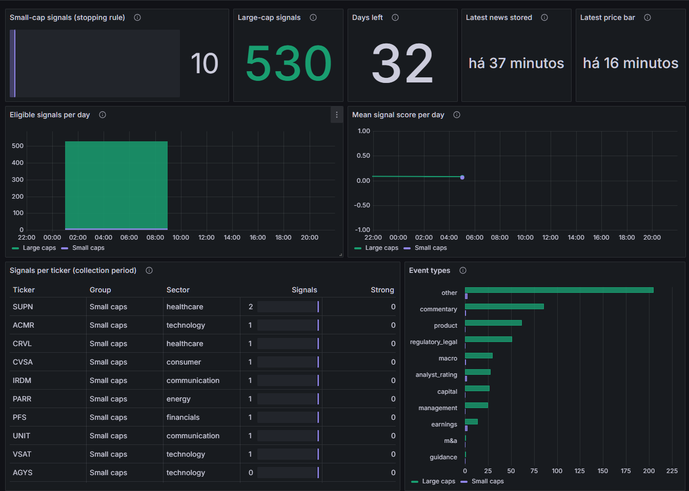

# News Sentiment Trading Signals

**Does LLM-read news move stock prices, and more so for companies few people follow?**
A real-time pipeline that turns company news into per-stock sentiment signals with an LLM,
and a pre-registered event study that tests them against market prices.

[](https://github.com/pedropereira4/news-sentiment-trading-signals/actions/workflows/ci.yml)


| | |
|---|---|
| **Question** | Does news sentiment predict abnormal returns (vs `SPY`), and is the effect larger for a random sample of S&P SmallCap 600 stocks than for the 10 most covered large caps? |
| **Data** | Finnhub company news for 40 US stocks, classified by an LLM (Gemini via OpenRouter) into one signal per company; 1-minute prices from Alpaca (SIP) |
| **Method** | Market-adjusted event study at 5 min, 1 h, 1 day and 5 days; protocol, stopping rule and primary test [registered before any result](config/study.yaml) |
| **Engineering** | Kafka streaming, validated LLM output, idempotent sinks, PostgreSQL system of record, dashboards as code, CI with unit, known-answer and real-Postgres tests |
| **Status** | Collecting data from 2026-09-28 until 300 small-cap signals or 2026-10-30. [Results](#results) will be published whatever they show. |



---

## Why this project

Sentiment models are easy to build and hard to evaluate. Most demos stop at "the model says
this headline is positive". This one asks whether that label is worth anything in the market,
and sets the test up so that the answer can be "no":

- **Per-company signals, not per-headline tone.** *"Apple wins a contract from Samsung"* is
  good for one stock and bad for the other; the LLM returns direction, strength, event type
  and whether the news is new information, for each company.
- **A control group chosen by a rule, not by me.** 30 small caps drawn at random (fixed seed)
  from the S&P SmallCap 600, against the 10 most covered large caps in the same six sectors.
- **No peeking.** The hypothesis, data filters, horizons, stopping rule and regression were
  fixed in [`study.yaml`](config/study.yaml) before collection; the monitoring dashboard shows
  data volume and health, never returns; changes are dated amendments.
- **No look-ahead.** Prices at time *t* come only from bars that had closed by *t*; windows that
  have not finished are `pending`, never filled in.

It runs 24/7 on a laptop for a few dollars a month of LLM usage (~$0.0002 per news item).

---

## Results

> **Collection in progress.** The registered analysis runs once, when the stopping rule is
> met (300 small-cap signals or 2026-10-30). This section will then hold the report and chart
> from `sp-event-study`, including null results.

| | Large caps | Small caps (S&P 600 sample) |
|---|---|---|
| Eligible signals | – | – |
| Mean 1-day abnormal return, strong positive signals | – | – |
| Mean 1-day abnormal return, strong negative signals | – | – |

**Primary test** (score × small-cap interaction, 1-day abnormal return, bps per unit of
score): –

---

## Architecture



| Service | Responsibility | Scales by |
|---|---|---|
| **finnhub-producer** | Polls Finnhub company news for each watchlist ticker, merges copies of the same story returned for several tickers, paces requests under the free-tier limit | one instance (stateful poller) |
| **producer** *(optional)* | Polls general-news RSS feeds, builds `RawArticle`, drops duplicates (persistent LRU), publishes keyed by source. Off by default (compose profile `rss`): the event study uses company news only | one instance (stateful poller) |
| **enricher** | Consumes `news.raw` in batches, one LLM call per batch, validates JSON output, publishes `EnrichedArticle` | consumer group, up to #partitions |
| **writer** | Consumes `news.enriched`, writes batched points to InfluxDB, commits offsets after the write | consumer group |
| **postgres-writer** | Consumes `news.enriched` in its own consumer group, upserts articles and per-ticker signals into PostgreSQL in one transaction per batch, then commits offsets | consumer group |
| **price-ingestor** | Every 15 min, fetches 1-minute bars from Alpaca for the watchlist and `SPY` after the last stored bar; backfills new tickers separately; upserts into `price_bars` | one instance |
| **kafka-init** | Creates topics with explicit partitions (auto-creation is disabled) | – |

Each stage is an independent consumer group, so the LLM step can be scaled, swapped or
replayed (reset offsets on `news.raw`) without touching ingestion or storage.

---

## Key design decisions

**1. Micro-batching LLM calls.** The enricher groups up to `ENRICHER_BATCH_SIZE` headlines
(or whatever arrives within `ENRICHER_BATCH_TIMEOUT_SECONDS`) into a single numbered prompt.
This cuts API cost and request count roughly by the batch size while keeping latency at
a few seconds.

**2. Never trust LLM output.** The response is parsed defensively (code fences, surrounding
prose, bare lists) and validated item by item with Pydantic (`sentiment` enum, `score ∈ [-1,1]`,
normalised topics). If a batch fails or some items are missing, the enricher **splits the batch
and retries items individually**; only items that still fail go to `news.dlq` with the error,
the original payload and the Kafka coordinates — one bad headline never blocks the stream.

**3. At-least-once + idempotent sink = effectively-once results.** Offsets are committed
manually, only after downstream produce/write succeeds. Re-processing after a crash is therefore
possible, so the writer makes it harmless: the InfluxDB timestamp is `published_at` plus a
deterministic sub-second offset derived from the article id. Same article → same series + same
timestamp → the point is overwritten, not double-counted — and without a high-cardinality
`id` tag.

**4. Provider-agnostic LLM layer.** `OllamaClient` (a model running locally), `OpenRouterClient`,
`AnthropicClient` and an offline `MockClient` implement one `classify()` interface; the provider
is a config switch. Retries use exponential backoff with jitter for 429/5xx/network errors only.
Ollama and OpenRouter share the same OpenAI-compatible base class, so pointing the pipeline at
vLLM or any other compatible server is a URL change. The mock lets the full stack (and CI) run
with no model at all.

**5. Explicit contracts.** Every topic has a Pydantic schema with a `schema_version`
(`src/sentiment_pipeline/schemas.py`). Idempotent Kafka producers (`acks=all`,
`enable.idempotence`), `zstd` compression and source-based keys preserve per-source ordering.

**6. Dashboards as code.** Grafana datasources and dashboards are provisioned automatically;
the JSON is generated by scripts, so Flux and SQL queries are reviewable in diffs, and every
SQL panel query is executed against a real Postgres in the tests.

---

## Data model

### Kafka topics

| Topic | Partitions | Key | Value |
|---|---|---|---|
| `news.raw` | 3 | source | `RawArticle` |
| `news.enriched` | 3 | source | `EnrichedArticle` |
| `news.dlq` | 1 | original key | `DeadLetter` |

```jsonc
// news.enriched
{
  "schema_version": 2,
  "id": "3f9c…",                      // sha256(url)[:32]
  "source": "bbc_business",
  "title": "Central bank holds rates as inflation cools",
  "url": "https://…",
  "tickers": [],                      // tickers supplied by the source, if any
  "published_at": "2026-09-17T10:02:00Z",
  "timestamp_source": "feed",         // "ingested" when the feed carried no date
  "sentiment": "positive",            // article-level tone
  "score": 0.35,
  "confidence": 0.82,
  "topics": ["interest rates", "inflation"],
  "signals": [                        // one per company, can disagree with each other
    {"ticker": "JPM", "sentiment": "positive", "score": 0.4, "confidence": 0.7,
     "event_type": "macro", "is_new_info": true}
  ],
  "llm_provider": "ollama",
  "llm_model": "llama3.2:3b",
  "llm_latency_ms": 212
}
```

### InfluxDB measurements

| Measurement | Tags | Fields |
|---|---|---|
| `article_sentiment` | `source`, `sentiment`, `llm_model` | `score`, `confidence`, `llm_latency_ms`, `title`, `url`, `topics` |
| `topic_mention` | `topic`, `source`, `sentiment` | `score`, `count` |
| `ticker_signal` | `ticker`, `event_type`, `sentiment`, `source` | `score`, `confidence`, `is_new_info`, `feed_timestamp`, `title` |

### PostgreSQL (system of record)

InfluxDB keeps 30 days for the dashboards; PostgreSQL keeps everything, because the event
study needs weeks to months of signals. The schema lives in
[`storage/schema.sql`](src/sentiment_pipeline/storage/schema.sql) and is applied idempotently
by the writer on startup.

| Table | Grain | Key columns |
|---|---|---|
| `tickers` | one per watchlist ticker (synced from `watchlist.yaml`) | `cap_group`, `sector` |
| `articles` | one per news item | `published_at`, `timestamp_source`, article-level sentiment, `llm_model` |
| `ticker_signals` | one per (article, company) | `ticker`, `published_at`, `score`, `event_type`, `is_new_info` |
| `price_bars` | one per (ticker, minute), watchlist + `SPY` | OHLCV, `vwap`, `trade_count`, `feed` |
| `v_signals` (view) | signals joined with article and ticker group/sector | – |

Writes are idempotent: articles are upserted by id and their signals replaced inside the same
transaction, so Kafka redelivery or a full replay with another model overwrites instead of
duplicating, and a failed batch leaves nothing half-written. Because the writer is its own
consumer group, a new deployment backfills everything still retained in `news.enriched`.

```sql
-- Strong, new-information signals per group and event type
SELECT cap_group, event_type, count(*) AS n, round(avg(score)::numeric, 2) AS avg_score
FROM v_signals
WHERE feed_timestamp AND is_new_info AND abs(score) >= 0.6
GROUP BY 1, 2 ORDER BY n DESC;
```

Prices come from Alpaca's `sip` feed (every US exchange, so real volume) when the plan allows
it: on the free plan SIP is served with a ~15-minute delay, so the ingestor always stays
16 minutes behind. That is irrelevant for an event study run after the fact. If the account
cannot use SIP at all it falls back to `iex` and records the feed on every bar.

`topic_mention` has one point per (article, topic), which makes "top topics" and
"average sentiment per topic" simple aggregations. `ticker_signal` has one point per
(article, company): the per-stock view used downstream for trading signals.

### Why per-ticker signals (schema v2)

A single score per headline is not enough for markets: *"Apple wins contract from Samsung"*
is good for one stock and bad for the other, and *"revenue beats but guidance cut"* is
usually negative despite a positive headline. The LLM therefore returns, per company:
direction and strength (`sentiment`, `score`, `confidence`), the kind of event
(`event_type`: earnings, guidance, m&a, analyst_rating, product, regulatory_legal,
management, capital, macro, commentary, other) and `is_new_info`, which separates new facts
from recaps and opinion pieces. Malformed signals are dropped individually, so one bad
ticker never discards the rest of the item. Messages written with schema v1 still parse.

Signals are restricted to the watchlist: the prompt lists the companies of interest (ticker
and name, so "Nvidia" maps to `NVDA`), and anything else the model returns is dropped and
logged. This was added after a first run with a 3B local model, which produced invented
tickers (`TOKIO`, `NIXO`), exchange codes (`TWSE`) and placeholders (`NONE`) for general news.
There are no prices for tickers outside the universe, so they are useless downstream anyway.

`timestamp_source` records whether `published_at` came from the source or had to fall back
to the ingestion time: anything measuring price reactions must only use source timestamps.

---

## Dashboards

Two dashboards are provisioned automatically at <http://localhost:3000>, both generated from
code ([`build_dashboard.py`](scripts/build_dashboard.py),
[`build_study_dashboard.py`](scripts/build_study_dashboard.py)); tests fail if the committed
JSON drifts from its generator.

**Event study - data collection** (PostgreSQL). Progress and health of the study, built from
the registered protocol so it counts exactly what the analysis will use:

- Small-cap signals against the stopping rule, large-cap signals, days left
- Freshness of the last stored article and the last price bar
- Eligible signals and mean LLM score per day, per group
- Signals per ticker (including tickers with none yet) and event types per group
- Latest strong signals with links, signals excluded by protocol rule, price coverage per ticker
- **No returns anywhere**: a test fails if the dashboard ever reads `event_returns`



**Real-time news sentiment** (InfluxDB, home dashboard). The live view of the stream:

- Articles analysed, average sentiment, negative share, LLM latency
- Sentiment trend per source, distribution and hourly volume by sentiment
- Top topics, per-topic sentiment, latest headlines with links

---

## Quickstart

**Requirements:** Docker + Docker Compose. For real sentiment analysis, either
[Ollama](https://ollama.com) running locally (free) or an [OpenRouter](https://openrouter.ai) /
[Anthropic](https://console.anthropic.com) API key.

```bash
git clone https://github.com/pedropereira4/news-sentiment-trading-signals.git
cd news-sentiment-trading-signals
cp .env.example .env          # Windows PowerShell: Copy-Item .env.example .env
```

Edit `.env`. Company news needs a free [Finnhub](https://finnhub.io/register) key
(`FINNHUB_API_KEY=...`). General-news RSS feeds are optional: add `--profile rss` to the
`docker compose` commands to ingest them too (without a Finnhub key, they are the only source).
Local model, free and offline (`ollama pull llama3.2:3b` first):

```dotenv
LLM_PROVIDER=ollama
LLM_MODEL=llama3.2:3b
INFLUXDB_TOKEN=<a long random string>
```

Or a hosted model (recommended — small local models invent tickers and repeat default scores):

```dotenv
LLM_PROVIDER=openrouter        # or: anthropic | mock (no model needed at all)
LLM_MODEL=google/gemini-3.1-flash-lite
ENRICHER_BATCH_SIZE=10
OPENROUTER_API_KEY=sk-or-...
INFLUXDB_TOKEN=<a long random string>
```

Start everything:

```bash
docker compose up -d --build
docker compose logs -f enricher     # watch headlines being classified
```

> **InfluxDB token:** the bucket is created once, on the first start, and the token it ends up
> with is stored in its volume. If you later change `INFLUXDB_TOKEN` in `.env`, or wipe the
> volume, the two drift apart and the writer logs a 401 at startup. The token InfluxDB actually
> accepts is the `token = ...` line in
> `docker compose exec influxdb cat /etc/influxdb2/influx-configs` — copy that into `.env`, or
> wipe the volume (`docker compose down && docker volume rm sentiment-pipeline_influxdb-data`)
> to start clean.

| URL | What |
|---|---|
| <http://localhost:3000> | Grafana (admin / admin by default) |
| <http://localhost:8086> | InfluxDB UI |
| <http://localhost:8080> | Kafka UI — `docker compose --profile debug up -d kafka-ui` |

Useful commands:

```bash
docker compose up -d --scale enricher=3                  # parallel LLM workers
docker compose exec kafka /opt/kafka/bin/kafka-console-consumer.sh \
  --bootstrap-server kafka:9092 --topic news.dlq --from-beginning   # inspect failures
docker compose down -v                                   # stop and wipe data
```

> **Cost note:** with Ollama the pipeline costs nothing at all. With Gemini 3.1 Flash Lite on
> OpenRouter, batches of 10 cost about $0.0002 per news item: the 40-ticker watchlist comes to
> a few dollars a month. Finnhub (free tier) and Alpaca market data (free plan) cost nothing.

---

## Configuration

All settings are environment variables (see `.env.example`), loaded with `pydantic-settings`.

| Variable | Default | Description |
|---|---|---|
| `LLM_PROVIDER` | `mock` | `ollama`, `openrouter`, `anthropic` or `mock` |
| `LLM_MODEL` | `llama3.2:3b` | Model id/tag for the chosen provider |
| `OLLAMA_BASE_URL` | `http://host.docker.internal:11434` | Where Ollama listens |
| `ENRICHER_BATCH_SIZE` | `5` | Headlines per LLM call (10+ for hosted models) |
| `LLM_MAX_OUTPUT_TOKENS` | `4096` | Hard cap on the reply length |
| `ENRICHER_BATCH_TIMEOUT_SECONDS` | `5` | Max wait to fill a batch |
| `POLL_INTERVAL_SECONDS` | `120` | RSS polling interval |
| `FEEDS_FILE` | `/app/config/feeds.yaml` | Feed list (`source`, `url`) |
| `FINNHUB_API_KEY` | – | Finnhub key for company news |
| `WATCHLIST_FILE` | `/app/config/watchlist.yaml` | Tickers, company name, group (`large_cap` / `small_mid_cap`) and sector; the enricher keeps signals only for these |
| `FINNHUB_POLL_INTERVAL_SECONDS` | `120` | One request per ticker per cycle |
| `FINNHUB_LOOKBACK_DAYS` | `7` | Calendar days requested per cycle (the machine can be off for most of a week without missing news) |
| `INFLUXDB_*` | – | Connection and bootstrap settings |
| `ALPACA_API_KEY` / `ALPACA_SECRET_KEY` | – | Alpaca keys (paper-trading keys work) |
| `ALPACA_DATA_FEED` | `sip` | `sip` (all exchanges, delayed on free plan) or `iex` |
| `PRICE_POLL_INTERVAL_SECONDS` / `PRICE_BACKFILL_DAYS` | `900` / `10` | Price polling and initial history |
| `POSTGRES_DB` / `POSTGRES_USER` / `POSTGRES_PASSWORD` | `sentiment` / `sentiment` / – | PostgreSQL database and credentials |

Add or remove sources in [`config/feeds.yaml`](config/feeds.yaml) and restart the producer
(`docker compose --profile rss up -d producer`).

### Watchlist

[`config/watchlist.yaml`](config/watchlist.yaml) holds 40 tickers in two groups over the same
six sectors (technology, communication, consumer, financials, healthcare, energy):

- **`large_cap` (10):** the most covered companies in each sector - the control group.
- **`small_mid_cap` (30):** a **random sample, 5 per sector, from the S&P SmallCap 600**,
  drawn by [`scripts/build_watchlist.py`](scripts/build_watchlist.py) from a committed
  constituent snapshot ([`data/`](data/)) with a fixed seed.

The design question is whether news sentiment carries more information for companies that
fewer analysts and algorithms follow. The first version used 10 hand-picked small caps, and
the first two days of data showed two problems: they produced only 4% of all signals (5
strong ones), and hand-picking tends to select famous, heavily covered names, which biases
the group towards exactly the coverage it is supposed to lack. A larger, rule-based sample
fixes both: more events, and no selection by the author. A test checks that the committed
`watchlist.yaml` is exactly what the script generates. `SPY` is the benchmark for abnormal
returns.

### Study protocol (registered before any results)

[`config/study.yaml`](config/study.yaml) fixes the hypothesis, data, stopping rule and
analysis **before** the event study is run for the first time (2026-09-26):

- **Hypothesis:** LLM news sentiment predicts abnormal returns vs `SPY`, more strongly for
  less-covered companies (random S&P 600 sample) than for the most covered large caps.
- **Data:** from 2026-09-28 (first market day with the final watchlist), Finnhub news only,
  one LLM model throughout, source timestamps only.
- **Stopping rule:** 300 small-cap signals or 2026-10-30 (5 weeks), whichever comes first. The rule is
  based on sample size and time, never on the results.
- **Primary analysis:** 1-day abnormal return regressed on signal score with a
  score × group interaction; 5-minute, 1-hour and 5-day horizons are secondary (small caps
  often have no trade in a given minute, so the price at time *t* is the last trade at or
  before *t*).

Any later change goes into `amendments` with a date and a reason, and is reported with the
results. Stopping when the numbers look good, or reporting whichever horizon "worked", are
the usual ways a backtest finds an effect that is not there.

### Running the event study

The analysis runs on demand from the host. It reads PostgreSQL on `localhost:$POSTGRES_PORT`
(default 5432; set `POSTGRES_PORT=5433` in `.env` if a local PostgreSQL install already uses 5432):

```bash
pip install -e ".[analysis]"
sp-event-study --status   # progress towards the stopping rule; computes no returns
sp-event-study --pilot    # same code on all data so far, labelled PILOT (checks, not results)
sp-event-study            # the registered analysis -> reports/event_study_<date>.md + chart
```

For every eligible signal and horizon it computes the market-adjusted abnormal return
(stock return minus `SPY` return), stores it in `event_returns`, and writes a report with the
mean abnormal return of strong signals per group (95% CIs), the registered regression and the
method. Details that keep it honest:

- **No look-ahead in prices:** the price at *t* is the close of the last 1-minute bar that
  *ended* by *t*; a bar that contains the news minute may include trades after it.
- **Thin trading is visible:** small caps often have no trade in a given minute, so the price
  at *t* is the last trade, and the report shows the share of windows with at least one trade.
- **Unfinished windows are `pending`**, never filled with the last known price.
- **Trading days come from `SPY`'s own sessions**, so weekends and holidays need no calendar.
- **Conservative inference:** each coefficient uses the largest of the classic, HC1 and
  day-clustered standard errors. On simulated data with 7 trading days the clustered errors
  alone were ~7x too small; this is recorded as a dated amendment in `study.yaml`.
- **Known-answer tests:** synthetic prices with a planted effect (e.g. +40 bps per unit of
  score for small caps) must be recovered, inside the reported confidence interval.

---

## Project structure

```
.
├── docker-compose.yml          # Kafka, InfluxDB, PostgreSQL, Grafana, pipeline services
├── Dockerfile                  # one image, one command per service
├── config/feeds.yaml           # RSS sources
├── config/watchlist.yaml       # tickers, name, group, sector (generated)
├── config/study.yaml           # registered study protocol + amendments
├── src/sentiment_pipeline/
│   ├── config.py               # typed settings
│   ├── schemas.py              # Kafka message contracts
│   ├── common.py               # Kafka factories, batching, graceful shutdown
│   ├── producer/
│   │   ├── rss_producer.py
│   │   ├── finnhub_producer.py # company news per ticker
│   │   └── seen_store.py       # shared de-duplication state
│   ├── enricher/main.py        # batching, split-retry, DLQ
│   ├── llm/
│   │   ├── prompt.py           # prompt + defensive JSON parsing
│   │   └── clients.py          # Ollama / OpenRouter / Anthropic / Mock
│   ├── analysis/
│   │   ├── prices.py           # point-in-time prices, trading calendar from SPY
│   │   ├── event_study.py      # abnormal returns, CIs, registered regression
│   │   ├── data.py             # protocol filters, exclusions, results table
│   │   ├── report.py           # markdown report + chart
│   │   └── cli.py              # sp-event-study (--status / --pilot)
│   ├── market/
│   │   ├── alpaca.py           # bars client: pagination, retries, sip -> iex fallback
│   │   └── price_ingestor.py   # incremental 1-min bars -> price_bars
│   ├── storage/
│   │   ├── schema.sql          # tables, indexes, v_signals view
│   │   └── postgres.py         # idempotent transactional batch writes
│   ├── watchlist.py            # universe shared by producer and enricher
│   └── writer/
│       ├── influx_writer.py    # idempotent point mapping
│       └── postgres_writer.py  # system-of-record sink
├── grafana/
│   ├── provisioning/           # InfluxDB + PostgreSQL datasources, dashboard provider
│   └── dashboards/             # generated JSON (do not edit by hand)
├── scripts/build_dashboard.py  # live sentiment dashboard as code
├── scripts/build_study_dashboard.py  # study dashboard, generated from study.yaml
├── scripts/build_watchlist.py  # rule-based small-cap sample (seeded)
├── data/                       # S&P SmallCap 600 constituent snapshot
├── docs/img/                    # dashboard screenshots
├── reports/                    # event-study reports (pilot runs are git-ignored)
├── tests/                      # unit, known-answer and Postgres integration tests
└── .github/workflows/ci.yml    # lint, tests, compose validation
```

---

## Local development

```bash
python -m venv .venv && source .venv/bin/activate   # Windows: .venv\Scripts\activate
pip install -e ".[dev]"
pytest -q                       # unit tests; Postgres integration tests are skipped
# With a database (CI does this with a Postgres service container):
PG_TEST_DSN=postgresql://sentiment:<password>@localhost:<POSTGRES_PORT>/sentiment pytest -q
ruff check . && ruff format --check .
```

Run a service on the host against the dockerised infrastructure (Kafka is exposed on
`localhost:29092`):

```bash
docker compose up -d kafka kafka-init influxdb grafana
KAFKA_BOOTSTRAP_SERVERS=localhost:29092 OLLAMA_BASE_URL=http://localhost:11434 sp-enricher
```

---

## Roadmap

- [ ] Publish the registered event-study results (after 2026-10-30)
- [ ] Signal engine: strong signals -> Alpaca paper-trading orders with position limits
- [ ] Evaluation set: compare LLM labels against a human-labelled sample (accuracy / Cohen's κ) and against FinBERT as a baseline
- [ ] Structured outputs / tool calling instead of prompt-enforced JSON
- [ ] Schema Registry (Avro/Protobuf) instead of JSON
- [ ] Prometheus metrics (consumer lag, LLM tokens & cost) and Grafana alerts on sentiment spikes
- [ ] Topic canonicalisation with embeddings to merge near-duplicate topics
- [ ] Integration tests with Testcontainers

## License

MIT
