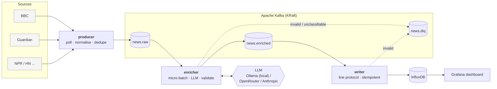

# Real-time News Sentiment Pipeline

**Streaming news headlines → LLM sentiment & topic extraction → time-series analytics, live.**


This project ingests RSS feeds from major news outlets, streams every new headline through
Apache Kafka, uses a Large Language Model to classify its **sentiment** (label + score) and
extract **key topics**, stores the results in InfluxDB and visualises how the tone of the news
evolves on a live Grafana dashboard.

It is built as a production-style, event-driven system rather than a notebook: typed message
contracts, micro-batched LLM calls, at-least-once delivery with idempotent writes, a dead-letter
queue, retries with backoff, tests and CI. The whole stack starts with one command.

<!-- Add a screenshot after your first run: docs/dashboard.png -->
<!--  -->

---

## Architecture



| Service | Responsibility | Scales by |
|---|---|---|
| **producer** | Polls RSS feeds, builds `RawArticle`, drops duplicates (persistent LRU), publishes keyed by source | one instance (stateful poller) |
| **enricher** | Consumes `news.raw` in batches, one LLM call per batch, validates JSON output, publishes `EnrichedArticle` | consumer group, up to #partitions |
| **writer** | Consumes `news.enriched`, writes batched points to InfluxDB, commits offsets after the write | consumer group |
| **kafka-init** | Creates topics with explicit partitions (auto-creation is disabled) | – |

Each stage is an independent consumer group, so the LLM step can be scaled, swapped or
replayed (reset offsets on `news.raw`) without touching ingestion or storage.

---

## Key design decisions

**1. Micro-batching LLM calls.** The enricher groups up to `ENRICHER_BATCH_SIZE` headlines
(or whatever arrives within `ENRICHER_BATCH_TIMEOUT_SECONDS`) into a single numbered prompt.
This cuts API cost and request count roughly by the batch size while keeping latency at
a few seconds.

**2. Never trust LLM output.** The response is parsed defensively (code fences, surrounding
prose, bare lists) and validated item by item with Pydantic (`sentiment` enum, `score ∈ [-1,1]`,
normalised topics). If a batch fails or some items are missing, the enricher **splits the batch
and retries items individually**; only items that still fail go to `news.dlq` with the error,
the original payload and the Kafka coordinates — one bad headline never blocks the stream.

**3. At-least-once + idempotent sink = effectively-once results.** Offsets are committed
manually, only after downstream produce/write succeeds. Re-processing after a crash is therefore
possible, so the writer makes it harmless: the InfluxDB timestamp is `published_at` plus a
deterministic sub-second offset derived from the article id. Same article → same series + same
timestamp → the point is overwritten, not double-counted — and without a high-cardinality
`id` tag.

**4. Provider-agnostic LLM layer.** `OllamaClient` (a model running locally), `OpenRouterClient`,
`AnthropicClient` and an offline `MockClient` implement one `classify()` interface; the provider
is a config switch. Retries use exponential backoff with jitter for 429/5xx/network errors only.
Ollama and OpenRouter share the same OpenAI-compatible base class, so pointing the pipeline at
vLLM or any other compatible server is a URL change. The mock lets the full stack (and CI) run
with no model at all.

**5. Explicit contracts.** Every topic has a Pydantic schema with a `schema_version`
(`src/sentiment_pipeline/schemas.py`). Idempotent Kafka producers (`acks=all`,
`enable.idempotence`), `zstd` compression and source-based keys preserve per-source ordering.

**6. Dashboard as code.** Grafana datasource and dashboard are provisioned automatically;
the dashboard JSON is generated from `scripts/build_dashboard.py` so Flux queries are
reviewable in diffs.

---

## Data model

### Kafka topics

| Topic | Partitions | Key | Value |
|---|---|---|---|
| `news.raw` | 3 | source | `RawArticle` |
| `news.enriched` | 3 | source | `EnrichedArticle` |
| `news.dlq` | 1 | original key | `DeadLetter` |

```jsonc
// news.enriched
{
  "schema_version": 2,
  "id": "3f9c…",                      // sha256(url)[:32]
  "source": "bbc_business",
  "title": "Central bank holds rates as inflation cools",
  "url": "https://…",
  "tickers": [],                      // tickers supplied by the source, if any
  "published_at": "2026-09-17T10:02:00Z",
  "timestamp_source": "feed",         // "ingested" when the feed carried no date
  "sentiment": "positive",            // article-level tone
  "score": 0.35,
  "confidence": 0.82,
  "topics": ["interest rates", "inflation"],
  "signals": [                        // one per company, can disagree with each other
    {"ticker": "JPM", "sentiment": "positive", "score": 0.4, "confidence": 0.7,
     "event_type": "macro", "is_new_info": true}
  ],
  "llm_provider": "ollama",
  "llm_model": "llama3.2:3b",
  "llm_latency_ms": 212
}
```

### InfluxDB measurements

| Measurement | Tags | Fields |
|---|---|---|
| `article_sentiment` | `source`, `sentiment`, `llm_model` | `score`, `confidence`, `llm_latency_ms`, `title`, `url`, `topics` |
| `topic_mention` | `topic`, `source`, `sentiment` | `score`, `count` |
| `ticker_signal` | `ticker`, `event_type`, `sentiment`, `source` | `score`, `confidence`, `is_new_info`, `feed_timestamp`, `title` |

`topic_mention` has one point per (article, topic), which makes "top topics" and
"average sentiment per topic" simple aggregations. `ticker_signal` has one point per
(article, company): the per-stock view used downstream for trading signals.

### Why per-ticker signals (schema v2)

A single score per headline is not enough for markets: *"Apple wins contract from Samsung"*
is good for one stock and bad for the other, and *"revenue beats but guidance cut"* is
usually negative despite a positive headline. The LLM therefore returns, per company:
direction and strength (`sentiment`, `score`, `confidence`), the kind of event
(`event_type`: earnings, guidance, m&a, analyst_rating, product, regulatory_legal,
management, capital, macro, commentary, other) and `is_new_info`, which separates new facts
from recaps and opinion pieces. Malformed signals are dropped individually, so one bad
ticker never discards the rest of the item. Messages written with schema v1 still parse.

`timestamp_source` records whether `published_at` came from the source or had to fall back
to the ingestion time: anything measuring price reactions must only use source timestamps.

---

## Dashboard

Provisioned automatically at <http://localhost:3000> (home dashboard):

- Articles analysed · average sentiment · negative share · LLM latency
- Sentiment trend per source (30-min mean)
- Sentiment distribution and hourly volume by sentiment
- Top topics and per-topic average sentiment
- Latest headlines table with clickable links
- `Source` variable to filter every panel

---

## Quickstart

**Requirements:** Docker + Docker Compose. For real sentiment analysis, either
[Ollama](https://ollama.com) running locally (free) or an [OpenRouter](https://openrouter.ai) /
[Anthropic](https://console.anthropic.com) API key.

```bash
git clone https://github.com/<your-user>/realtime-sentiment-pipeline.git
cd realtime-sentiment-pipeline
cp .env.example .env          # Windows PowerShell: Copy-Item .env.example .env
```

Edit `.env`. Local model, free and offline (`ollama pull llama3.2:3b` first):

```dotenv
LLM_PROVIDER=ollama
LLM_MODEL=llama3.2:3b
INFLUXDB_TOKEN=<a long random string>
```

Or a hosted model:

```dotenv
LLM_PROVIDER=openrouter        # or: anthropic | mock (no model needed at all)
LLM_MODEL=google/gemini-2.5-flash-lite
OPENROUTER_API_KEY=sk-or-...
INFLUXDB_TOKEN=<a long random string>
```

Start everything:

```bash
docker compose up -d --build
docker compose logs -f enricher     # watch headlines being classified
```

> **InfluxDB token:** the bucket is created once, on the first start, and the token it ends up
> with is stored in its volume. If you later change `INFLUXDB_TOKEN` in `.env`, or wipe the
> volume, the two drift apart and the writer logs a 401 at startup. The token InfluxDB actually
> accepts is the `token = ...` line in
> `docker compose exec influxdb cat /etc/influxdb2/influx-configs` — copy that into `.env`, or
> wipe the volume (`docker compose down && docker volume rm sentiment-pipeline_influxdb-data`)
> to start clean.

| URL | What |
|---|---|
| <http://localhost:3000> | Grafana (admin / admin by default) |
| <http://localhost:8086> | InfluxDB UI |
| <http://localhost:8080> | Kafka UI — `docker compose --profile debug up -d kafka-ui` |

Useful commands:

```bash
docker compose up -d --scale enricher=3                  # parallel LLM workers
docker compose exec kafka /opt/kafka/bin/kafka-console-consumer.sh \
  --bootstrap-server kafka:9092 --topic news.dlq --from-beginning   # inspect failures
docker compose down -v                                   # stop and wipe data
```

> **Cost note:** with Ollama the pipeline costs nothing at all. On a hosted provider, the
> default 6 feeds at a 2-minute poll produce a few hundred headlines per day, which batching
> turns into a few dozen API calls — cents per month on a small model.

---

## Configuration

All settings are environment variables (see `.env.example`), loaded with `pydantic-settings`.

| Variable | Default | Description |
|---|---|---|
| `LLM_PROVIDER` | `mock` | `ollama`, `openrouter`, `anthropic` or `mock` |
| `LLM_MODEL` | `llama3.2:3b` | Model id/tag for the chosen provider |
| `OLLAMA_BASE_URL` | `http://host.docker.internal:11434` | Where Ollama listens |
| `ENRICHER_BATCH_SIZE` | `5` | Headlines per LLM call (10+ for hosted models) |
| `ENRICHER_BATCH_TIMEOUT_SECONDS` | `5` | Max wait to fill a batch |
| `POLL_INTERVAL_SECONDS` | `120` | RSS polling interval |
| `FEEDS_FILE` | `/app/config/feeds.yaml` | Feed list (`source`, `url`) |
| `INFLUXDB_*` | – | Connection and bootstrap settings |

Add or remove sources in [`config/feeds.yaml`](config/feeds.yaml) and restart the producer.

---

## Project structure

```
.
├── docker-compose.yml          # Kafka (KRaft), InfluxDB, Grafana, pipeline services
├── Dockerfile                  # one image, three entrypoints
├── config/feeds.yaml           # RSS sources
├── src/sentiment_pipeline/
│   ├── config.py               # typed settings
│   ├── schemas.py              # Kafka message contracts
│   ├── common.py               # Kafka factories, batching, graceful shutdown
│   ├── producer/rss_producer.py
│   ├── enricher/main.py        # batching, split-retry, DLQ
│   ├── llm/
│   │   ├── prompt.py           # prompt + defensive JSON parsing
│   │   └── clients.py          # Ollama / OpenRouter / Anthropic / Mock
│   └── writer/influx_writer.py # idempotent point mapping
├── grafana/
│   ├── provisioning/           # datasource + dashboard provider
│   └── dashboards/news-sentiment.json
├── scripts/build_dashboard.py  # dashboard as code
├── tests/                      # pytest unit tests
└── .github/workflows/ci.yml    # lint, tests, compose validation
```

---

## Local development

```bash
python -m venv .venv && source .venv/bin/activate   # Windows: .venv\Scripts\activate
pip install -e ".[dev]"
pytest -q
ruff check . && ruff format --check .
```

Run a service on the host against the dockerised infrastructure (Kafka is exposed on
`localhost:29092`):

```bash
docker compose up -d kafka kafka-init influxdb grafana
KAFKA_BOOTSTRAP_SERVERS=localhost:29092 OLLAMA_BASE_URL=http://localhost:11434 sp-enricher
```

---

## Roadmap

- [ ] Evaluation set: compare LLM labels against a human-labelled sample (accuracy / Cohen's κ) and against FinBERT as a baseline
- [ ] Structured outputs / tool calling instead of prompt-enforced JSON
- [ ] Schema Registry (Avro/Protobuf) instead of JSON
- [ ] Prometheus metrics (consumer lag, LLM tokens & cost) and Grafana alerts on sentiment spikes
- [ ] Topic canonicalisation with embeddings to merge near-duplicate topics
- [ ] Integration tests with Testcontainers

## License

MIT
